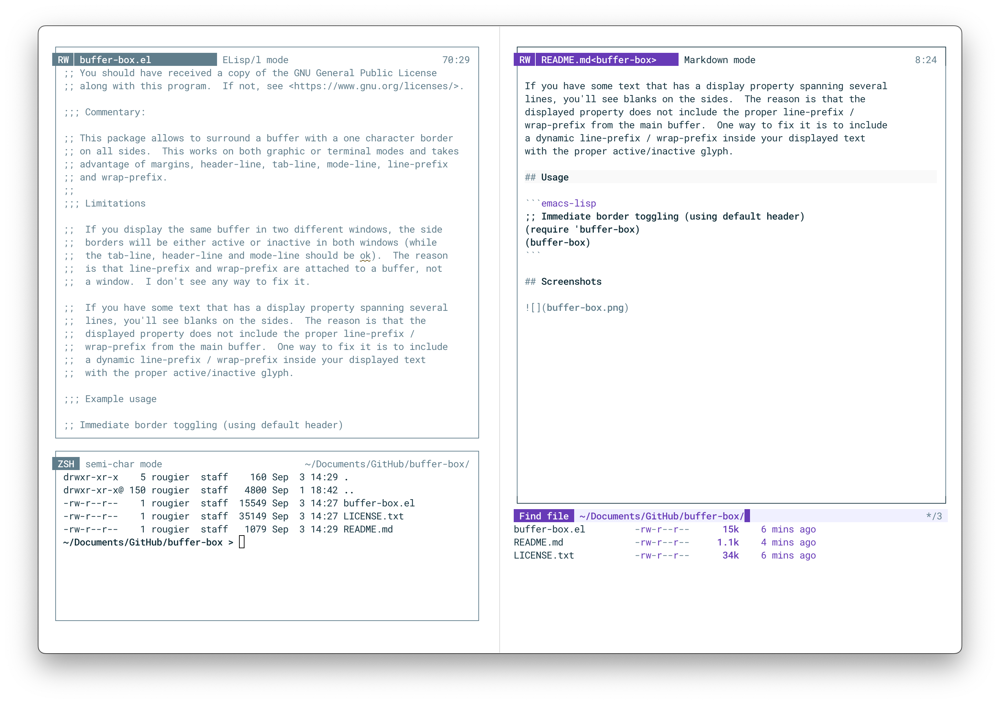

## Buffer box

This package allows to surround a buffer with a one character border
on all sides.  This works on both graphic or terminal modes and takes
advantage of margins, header-line, tab-line, mode-line, line-prefix
and wrap-prefix.

## Limitations

If you display the same buffer in two different windows, the side
borders will be either active or inactive in both windows (while
the tab-line, header-line and mode-line should be ok).  The reason
is that line-prefix and wrap-prefix are attached to a buffer, not
a window.  I don't see any way to fix it.

If you have some text that has a display property spanning several
lines, you'll see blanks on the sides.  The reason is that the
displayed property does not include the proper line-prefix /
wrap-prefix from the main buffer.  One way to fix it is to include
a dynamic line-prefix / wrap-prefix inside your displayed text
with the proper active/inactive glyph.

## Usage

```emacs-lisp
;; Immediate border toggling (using default header)
(require 'buffer-box)
(buffer-box)
```

## Screenshots




